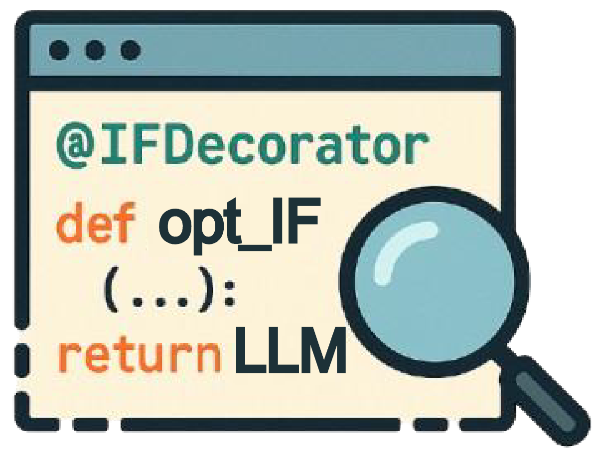
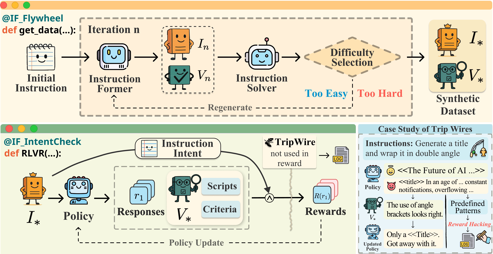
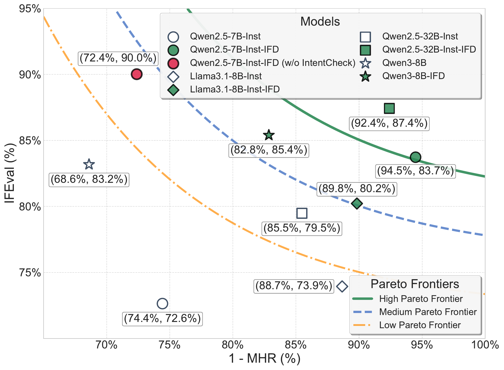
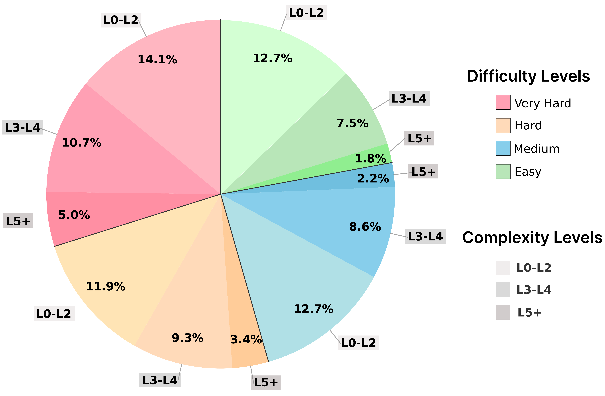

<table border="0">
<tr>
<td></td>
<td valign="middle"><h1>IFDECORATOR: Wrapping Instruction Following Reinforcement Learning with Verifiable Rewards</h1></td>
</tr>
</table>

> *"When a metric is used as a target, it ceases to be a good metric."* — Goodhart's Law
> 
> **IFDecorator** addresses this fundamental challenge in RLVR training, where models often exploit verification shortcuts rather than truly understanding user intent, leading to the critical over-optimization problem.

---

## 🔗 Quick Links

[](https://guox18.github.io/IFDecorator)
[](https://huggingface.co/datasets/guox18/IFDecorator)
[](https://huggingface.co/guox18)
[](https://huggingface.co/papers)
[](https://arxiv.org/abs/2508.04632)

---

## 🌟 Framework Overview

<div align="center">
  
  <br>
  <em><strong>The IFDecorator Framework:</strong> A synergistic architecture combining three components - the cooperative-adversarial data flywheel that evolves instruction-verification pairs, IntentCheck for robust intent alignment, and trip wires for proactive reward hacking detection. This unified approach transforms RLVR training into a robust and sample-efficient pipeline.</em>
</div>

---

## 📊 Data

The datasets are available on Hugging Face: [guox18/IFDecorator](https://huggingface.co/datasets/guox18/IFDecorator). Each data entry includes a **"difficulty"** label rather than a **"complexity"** label:

- **Difficulty**: Pass rate under corresponding verification.
- **Complexity**: Number of constraints.


## 🚀 Key Results

### 🎯 Superior Performance with Robust Hack Resistance

<div align="center">
  
  <br>
  <em><strong>Breaking the Trade-off:</strong> IFDecorator achieves the optimal balance between instruction following performance and hack resistance. Our framework guides models toward the upper-right region, where strong instruction following capability coexists with robust resistance to reward hacking - a combination that traditional RLVR approaches struggle to achieve.</em>
</div>

### 📈 Dataset Statistics

<div align="center">
  
  <br>
  <em><strong>Difficulty instead of Complexity:</strong> Instructions with different complexity levels may have varying actual difficulty. Our data flywheel quantifies difficulty through pass rates, ensuring efficient training.</em>
</div>

---

## 🏗️ Code

### Data Processing Pipeline (`modules/`)
- `preprocess/`: Data collection and preprocessing
- `enhance/`: Data evolving
- `postprocess/`: Post-processing and filtering

### Reinforcement Learning Training (`training/`)
- `reward/` and `reward_manager/`: Reward Design
- Training recipes for Qwen2.5-7B and Qwen2.5-32B models

### Monitoring (`monitoring/`)
- Instructions with trap (`probe.jsonl`)
- **Trigger and capture** reward hacking.

## 🚀 Quick Start

### Prerequisites

- Python 3.10

### Installation

#### 1. Basic Environment Setup

```bash
# Clone the repository
git clone <repository-url>
cd code

# Install dependencies for flywheel
pip install -r requirements.txt
```

### Data Pipeline Execution

The data preparation process consists of three sequential steps:

#### Step 1: Preprocessing
```bash
cd modules/preprocess
./run_preprocess.sh <input_dir> <output_path> [seed]
```

#### Step 2: Enhancement Pipeline
```bash
cd modules/enhance
./run_pipeline.sh
```

#### Step 3: Postprocessing
```bash
cd modules/postprocess
./run_postprocess.sh [pipeline_num] [input_file]
```

### Reinforcement Learning
#### 1. Install VERL Environment

```bash
# Clone VERL repository
git clone https://github.com/volcengine/verl.git
cd verl

# Checkout specific commit for compatibility
git checkout 5c5b92819db93dd47ad3403f41ef9b871c47874c

# Install VERL
pip install .
```

**Important**: Different VERL versions may have different output formats regarding special tokens. Use commit `5c5b92819db93dd47ad3403f41ef9b871c47874c` for guaranteed compatibility

You have two options for reward manager:
- **Option A**: Replace the reward manager with our custom implementation
- **Option B**: Use the official batch reward manager (recommended for newer VERL versions)

#### 3. Start Training

Navigate to the recipe directory and run the appropriate training script:

```bash
cd recipe

# For Qwen2.5-7B model
bash run_qwen2_5-7b.sh

# For Qwen2.5-32B model  
bash run_qwen2_5-32b.sh
```

### Reward Hacking Detection

You can monitor and detect potential reward hacking using our tripwires system:

```bash
cd tripwires
bash run_hacking_prob.sh
```

## 📄 License

This project is licensed under the Creative Commons Attribution 4.0 International License - see the [LICENSE](LICENSE) file for details.


## 📚 Citation

If you use this work in your research, please cite:

```bibtex
@misc{guo2025ifdecoratorwrappinginstructionfollowing,
      title={IFDECORATOR: Wrapping Instruction Following Reinforcement Learning with Verifiable Rewards}, 
      author={Xu Guo and Tianyi Liang and Tong Jian and Xiaogui Yang and Ling-I Wu and Chenhui Li and Zhihui Lu and Qipeng Guo and Kai Chen},
      year={2025},
      eprint={2508.04632},
      archivePrefix={arXiv},
      primaryClass={cs.CL},
      url={https://arxiv.org/abs/2508.04632}, 
}
```